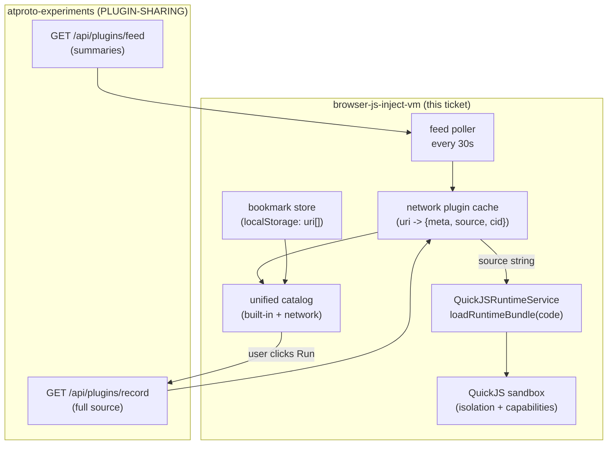

# Network Plugin Loading & Execution — Design & Implementation Guide

## 1. Executive summary

This guide designs the **execution side** of social JavaScript plugin sharing. The companion ticket `PLUGIN-SHARING` publishes plugin scripts as ATProto records and exposes a feed of them through a local server. This ticket makes the browser VM consume that feed: discover plugins, bookmark the ones the user wants, fetch each plugin's source over the network, and execute it inside the existing QuickJS sandbox.

The central architectural fact that makes this tractable: **the runtime already accepts plugin source as a string.** `QuickJSRuntimeService.loadRuntimeBundle(stackId, sessionId, packageIds, code)` takes the `.vm.js` source as its `code` parameter and evaluates it into a QuickJS context. Today that string comes from a Vite `?raw` import at build time. Network loading replaces the import with a `fetch()`; everything downstream — the bootstrap kernel, package installation, metadata validation, surface rendering, action routing, capability gating — is unchanged.

The deliverables are four things:

1. A **network plugin source** that fetches plugin summaries from `GET /api/plugins/feed` and full source from `GET /api/plugins/record`, producing manifest entries with the same `PluginManifestEntry` shape as the built-in catalog.
2. A **bookmark store** (localStorage-backed) that records which discovered plugins the user is interested in, so the set of runnable network plugins survives reloads.
3. A **unified catalog** that lists built-in and network plugins together, with a clear visual distinction and an opt-in "Add" action that bookmarks a network plugin and loads it.
4. An **untrusted-plugin security policy** that extends the existing three-layer model (QuickJS isolation, data-only boundary, capability gating) with content-addressed caching, deny-by-default capabilities, and explicit user opt-in before execution.

The work builds on the `browser-js-inject-vm` repository. It reuses the runtime service, the manifest type, the catalog component, and the FRP host loop. No changes to the QuickJS boundary or the action protocol are required for v1.

## 2. Problem statement and scope

### 2.1 The problem

The `browser-js-inject-vm` project's README states its limitation plainly: *"No network loading of third-party plugins (bundles are bundled at build time)."* The manifest (`src/plugins/manifest.ts`) imports every `.vm.js` file with `import x from './x.vm.js?raw'` and stores the resulting string in `bundleCode`. A user cannot run a plugin that another person published, because that plugin's source is not in the build.

`PLUGIN-SHARING` solves the supply side: plugins exist as ATProto records, discoverable through a feed. This ticket solves the demand side: the browser discovers them, lets the user pick, and runs them.

### 2.2 In scope

- A network plugin loader that fetches source strings and feeds them to `loadRuntimeBundle`.
- A bookmark store persisted to localStorage.
- A unified catalog UI (built-in + network plugins).
- An untrusted-plugin execution policy (caching, capabilities, opt-in).
- A live feed subscription (poll or WebSocket) for new plugins.

### 2.3 Out of scope

- **Publishing** plugins. That is `PLUGIN-SHARING`.
- **New sandbox primitives.** The QuickJS boundary, memory limits, deadline interrupts, and action protocol are reused as-is.
- **Plugin editing.** The browser runs plugins; it does not author them (the compose UI lives in the atproto-experiments server's frontend).
- **Cross-plugin communication.** Plugins remain isolated sessions; they communicate only through the feed middleware chain.

## 3. Background: the existing browser VM

An intern must understand five things about the current system before extending it. Each is summarized with the file that implements it.

### 3.1 The load seam

`src/runtime/plugin-runtime/runtimeService.ts` defines `QuickJSRuntimeService.loadRuntimeBundle`:

```ts
async loadRuntimeBundle(
  stackId: StackId,
  sessionId: SessionId,
  packageIds: string[],
  code: string,
): Promise<RuntimeBundleMeta>
```

The method (1) creates a QuickJS session, (2) installs the bootstrap kernel (`stack-bootstrap.vm.js`), (3) installs the requested runtime packages (e.g. `ui`), (4) runs `code` via `sessionService.runCode`, (5) reads the bundle metadata through `globalThis.__runtimeBundleHost.getMeta()`, and (6) validates it. The `code` parameter is the entire `.vm.js` source string.

**This is the seam.** The runtime is agnostic to where `code` came from. Replacing `import x from './x.vm.js?raw'` with `const code = await fetch(url).then(r => r.text())` changes the source of the string and nothing else.

### 3.2 The manifest

`src/plugins/manifest.ts` defines `PluginManifestEntry`:

```ts
export interface PluginManifestEntry {
  id: string;
  title: string;
  description: string;
  packageIds: string[];
  capabilities: Partial<CapabilityPolicy>;
  homeSurface: string;
  bundleCode: string;        // the .vm.js source
  category?: string;
}
```

Two arrays are exported: `PLUGIN_CATALOG` (built-in apps) and `FEED_PLUGINS` (built-in feed middleware). Both are populated at module load from `?raw` imports. `ALL_PLUGINS` is their concatenation.

**The extension:** introduce a third source of entries — network plugins — that produces `PluginManifestEntry` objects at runtime from fetched data. The catalog and runtime consume them identically.

### 3.3 A plugin bundle's shape

`src/plugins/feed-keyword-lens.vm.js` is the canonical example. A plugin calls `defineRuntimeBundle(factory)`, where the factory receives package APIs (e.g. `ui`) and returns a bundle object:

```js
defineRuntimeBundle(({ ui }) => ({
  id: 'feed-keyword-lens',
  title: 'Keyword Lens',
  packageIds: ['ui'],
  initialPluginState: { query: '', matchCount: 0 },
  surfaces: { panel: { packId: 'ui.card.v1', render({ state }) { ... }, handlers: { ... } } },
  feed: { apply({ posts, pluginState }) { ... } },
}));
```

A network plugin is the same shape. The author writes this source, publishes it as a `dev.atproto-demo.plugin` record (via `PLUGIN-SHARING`), and the browser fetches and evals it identically.

### 3.4 The catalog and the FRP host

`src/components/PluginCatalog.tsx` renders `ALL_PLUGINS` grouped by category, with Launch and View Source buttons. Launching a plugin mounts `PluginSurfaceHost`, which uses `usePluginRuntime` to run the FRP loop: register session → ensure QuickJS → seed state → render surface → route events.

For feed middleware plugins, `src/components/SocialFeed.tsx` manages the active sidebar list and runs `useFeedPluginPipeline`, which calls each active plugin's `feed.apply` / `feed.onIncomingMessage` hooks in sidebar order.

**The extension:** network plugins appear in the catalog and can be launched or added to the feed sidebar exactly like built-ins, because they share the `PluginManifestEntry` type.

### 3.5 The security model

The existing model has three layers (from the README):

1. **Execution isolation** — each session is a separate QuickJS WASM context with no host globals (`window`, `document`, `fetch`), a 32 MiB memory cap, and a deadline interrupt.
2. **Data-only protocol** — plugins return JSON trees and emit `{ type, payload }` actions; they never receive a live host reference.
3. **Capability gating** — emitted actions are checked against the manifest's `capabilities` grant; denied actions are recorded in the timeline.

Built-in plugins are trusted because their source is in the build. Network plugins are **untrusted**. The three layers still apply, but v1 adds a fourth: **user opt-in and content-addressed caching**, because network source is arbitrary code from arbitrary authors.

## 4. Architecture



**Discovery:** the feed poller fetches `GET /api/plugins/feed` periodically, producing plugin summaries. Summaries populate the network cache and the catalog.

**Bookmarking:** the user marks summaries they want. Bookmark URIs persist in localStorage. Only bookmarked network plugins are runnable (opt-in).

**Execution:** when the user launches a bookmarked network plugin, the loader fetches its full source from `GET /api/plugins/record` (if not cached), then calls `loadRuntimeBundle` with the source string. The QuickJS sandbox, validation, and action routing run unchanged.

## 5. The load seam extension

The minimal change to the runtime is none: `loadRuntimeBundle` already takes `code: string`. The change is in how the catalog and host obtain `bundleCode` for a network plugin.

### 5.1 A unified plugin entry

Extend `PluginManifestEntry` with an optional origin field so the catalog can distinguish built-in from network plugins:

```ts
export interface PluginManifestEntry {
  id: string;
  title: string;
  description: string;
  packageIds: string[];
  capabilities: Partial<CapabilityPolicy>;
  homeSurface: string;
  bundleCode: string;
  category?: string;
  // NEW:
  origin?: 'builtin' | 'network';
  uri?: string;   // AT URI for network plugins
  cid?: string;   // content hash for caching/integrity
}
```

Built-in entries get `origin: 'builtin'`. Network entries get `origin: 'network'`, `uri`, `cid`, and a `bundleCode` that is fetched lazily.

### 5.2 The network loader

A new module `src/plugins/networkLoader.ts`:

```ts
const FEED_URL = '/api/plugins/feed';
const RECORD_URL = '/api/plugins/record';

interface PluginSummary {
  uri: string; cid: string; authorDID: string;
  title: string; description: string; version: string;
  packageIds: string[]; capabilities: { domain: string[]; system: string[] };
  hooks?: { feedMiddleware: boolean; incomingFeedMessage: boolean };
}

// In-memory cache: uri -> { entry, sourceFetched }
const cache = new Map<string, { entry: PluginManifestEntry; source?: string }>();

export async function fetchFeed(): Promise<PluginSummary[]> {
  const res = await fetch(FEED_URL);
  return res.ok ? res.json() : [];
}

export function summaryToEntry(s: PluginSummary): PluginManifestEntry {
  return {
    id: s.uri,                       // use the AT URI as the stable id
    title: s.title || 'Untitled',
    description: s.description,
    packageIds: s.packageIds.length ? s.packageIds : ['ui'],
    capabilities: clampCapabilities(s.capabilities),  // see §7
    homeSurface: 'panel',
    bundleCode: '',                  // fetched lazily
    category: s.hooks?.feedMiddleware ? 'Network feed middleware' : 'Network apps',
    origin: 'network',
    uri: s.uri,
    cid: s.cid,
  };
}

export async function loadNetworkSource(uri: string, cid: string): Promise<string> {
  const cached = cache.get(uri);
  if (cached?.source) return cached.source;
  // uri = at://did:.../dev.atproto-demo.plugin/<rkey>
  const { did, rkey } = parseAtURI(uri);
  const res = await fetch(`${RECORD_URL}?repo=${did}&rkey=${rkey}`);
  const record = await res.json();
  const source = record.value?.source ?? '';
  // content-addressed integrity check (optional but recommended)
  if (cid && !verifyCID(source, cid)) {
    throw new Error(`plugin source CID mismatch for ${uri}`);
  }
  cache.set(uri, { ...cached, entry: cached!.entry, source });
  return source;
}
```

### 5.3 AT URI parsing (TypeScript)

Go's `net/url` cannot parse `at://` URIs; neither should the browser assume a generic URL parser handles the DID-with-colons correctly. Parse manually:

```ts
function parseAtURI(uri: string): { did: string; collection: string; rkey: string } {
  // at://did:plc:xxxx/collection/rkey
  const rest = uri.startsWith('at://') ? uri.slice(5) : uri;
  const [did, collection, rkey] = rest.split('/');
  return { did, collection, rkey };
}
```

## 6. Bookmarking

### 6.1 The bookmark store

A new module `src/plugins/bookmarks.ts` persists the user's chosen plugin URIs to localStorage. Bookmarks are the opt-in gate: a network plugin is runnable only if bookmarked.

```ts
const KEY = 'vm-plugin-bookmarks';

export function getBookmarks(): string[] {
  try { return JSON.parse(localStorage.getItem(KEY) ?? '[]'); }
  catch { return []; }
}

export function isBookmarked(uri: string): boolean {
  return getBookmarks().includes(uri);
}

export function addBookmark(uri: string): void {
  const next = Array.from(new Set([...getBookmarks(), uri]));
  localStorage.setItem(KEY, JSON.stringify(next));
  window.dispatchEvent(new CustomEvent('bookmarks-changed'));
}

export function removeBookmark(uri: string): void {
  const next = getBookmarks().filter(u => u !== uri);
  localStorage.setItem(KEY, JSON.stringify(next));
  window.dispatchEvent(new CustomEvent('bookmarks-changed'));
}
```

A small React hook subscribes to the `bookmarks-changed` event and re-renders the catalog.

### 6.2 Bookmark UX

In the catalog, each network plugin summary shows an **Add** / **Added** toggle. Adding bookmarks the URI and fetches the source eagerly (so the user can inspect it before running). The source viewer (`src/components/SourceViewer.tsx`) renders the fetched source, reusing the existing dependency-free tokenizer. This inspection step is part of the trust story: the user can read exactly what will run.

### 6.3 Why localStorage and not records

v1 stores bookmarks locally. A user's bookmarks are their private selection, not public content. Publishing bookmarks as ATProto records (e.g. a `dev.atproto-demo.bookmark` record or a list) is a future phase that would make the selection shareable and sync across devices. The Lexicon in `PLUGIN-SHARING` does not include a bookmark record type; adding one is a separate decision.

## 7. Untrusted-plugin security policy

Built-in plugins are trusted (their source is in the build). Network plugins are untrusted. The existing three layers still apply; v1 adds a fourth.

### 7.1 Layer 1 unchanged: QuickJS isolation

Network plugins run in the same QuickJS WASM context as built-ins: no `window`, `document`, or `fetch`; a 32 MiB memory cap; a deadline interrupt (100 ms render / 100 ms event/hook). An infinite loop in a network plugin is killed by the interrupt handler exactly as for built-ins. No change.

### 7.2 Layer 2 unchanged: data-only boundary

Plugins still receive JSON state and return JSON trees/actions. A network plugin cannot escape the sandbox to reach the host. No change.

### 7.3 Layer 3 strengthened: capability clamping

Built-in plugins declare their own capabilities and are trusted to use them. Network plugins declare capabilities in their record, but those declarations are untrusted. `clampCapabilities` enforces a safe upper bound:

```ts
const NETWORK_ALLOWED_DOMAINS = new Set(['feed']);   // feed middleware only
const NETWORK_ALLOWED_SYSTEM: string[] = [];         // no system actions

function clampCapabilities(declared: { domain: string[]; system: string[] }): Partial<CapabilityPolicy> {
  return {
    domain: (declared.domain ?? []).filter(d => NETWORK_ALLOWED_DOMAINS.has(d)),
    system: [],  // network plugins get no system actions in v1
  };
}
```

A network plugin that declares `domain: ['inventory']` is clamped to `domain: ['feed']` at most; if it emits an `inventory/*` action, the capability gate denies it and records `outcome: denied` in the timeline. This is the existing capability policy working with a stricter grant.

### 7.4 Layer 4 new: opt-in and content addressing

- **Opt-in.** A network plugin is not loaded until the user bookmarks it. The catalog shows summaries (metadata only); the source is fetched only after the user opts in. This prevents drive-by execution of arbitrary firehose content.
- **Content addressing.** Each plugin record has a CID (a content hash). The loader caches source keyed by URI and verifies the fetched source against the CID before eval. A mismatch (tampered source, wrong record) throws and is not executed. This is the same self-certifying property that makes ATProto records trustworthy.
- **Source inspection.** The source viewer renders the exact string that will be eval'd, so the user can audit it before running.

### 7.5 What v1 does NOT do

- No signature verification beyond CID. The CID proves the source matches the record; it does not prove the author is trustworthy. Trust in the author is the user's decision, informed by the feed (which shows the author's DID) and optionally by follows/labels in a future phase.
- No per-plugin resource quotas beyond the global 32 MiB / 100 ms limits.
- No network access from inside the sandbox (QuickJS has no `fetch` regardless).

## 8. Frontend implementation

### 8.1 Feed poller

A hook `src/plugins/useNetworkFeed.ts` polls `/api/plugins/feed` every 30 seconds and maintains the network cache. For v1, polling is simplest; a WebSocket subscription (mirroring the existing `/ws` post fan-out in atproto-experiments) is a future enhancement for real-time discovery.

```ts
export function useNetworkFeed() {
  const [summaries, setSummaries] = useState<PluginSummary[]>([]);
  useEffect(() => {
    let cancelled = false;
    async function tick() {
      const s = await fetchFeed();
      if (!cancelled) {
        s.forEach(summary => cacheEntry(summary));
        setSummaries(s);
      }
    }
    tick();
    const id = setInterval(tick, 30_000);
    return () => { cancelled = true; clearInterval(id); };
  }, []);
  return summaries;
}
```

### 8.2 Unified catalog

Extend `src/components/PluginCatalog.tsx` to merge built-in and network entries. Network entries are shown with a network badge and an Add/Run state:

```tsx
const networkEntries = useNetworkFeed().map(summaryToEntry);
const bookmarked = useBookmarks().map(uri => cache.get(uri)?.entry).filter(Boolean);
const allEntries = [...ALL_PLUGINS, ...bookmarked, ...networkEntries.filter(e => !isBookmarked(e.uri!))];
```

Network entries that are bookmarked appear in a "My plugins" group and are launchable. Unbookmarkeded entries appear in a "Discover" group with an Add button.

### 8.3 Launching a network plugin

The launch path fetches the source lazily, then runs the existing FRP loop. In `PluginSurfaceHost` (or a new `NetworkPluginHost`), before calling `usePluginRuntime`:

```tsx
async function ensureSource(entry: PluginManifestEntry): Promise<string> {
  if (entry.origin !== 'network') return entry.bundleCode;   // built-in
  if (entry.bundleCode) return entry.bundleCode;             // already fetched
  const source = await loadNetworkSource(entry.uri!, entry.cid!);
  entry.bundleCode = source;                                  // cache on the entry
  return source;
}
```

Then the existing `usePluginRuntime(plugin, sessionId, surfaceId)` runs unchanged, because it calls `loadRuntimeBundle(..., code)` internally with whatever `bundleCode` holds.

### 8.4 Feed middleware network plugins

For network plugins that declare `hooks.feedMiddleware`, the SocialFeed sidebar can include them. The active-plugin list in `SocialFeed.tsx` already accepts `PluginManifestEntry` objects; network entries with the `feed` capability are eligible. The `useFeedPluginPipeline` hook calls `handle.applyFeedMiddleware` exactly as for built-ins. The only addition is ensuring the source is loaded before the session is created.

## 9. Decision records

### DR-1: Reuse `loadRuntimeBundle` unchanged; change only the source of `code`

**Context.** The runtime service evaluates a source string. Network plugins are the same source strings, fetched instead of imported.

**Decision.** Do not fork the runtime. Add a network loader that produces `PluginManifestEntry` objects with lazily-fetched `bundleCode`. The catalog and host consume them identically.

**Rationale.** The load seam is already `code: string`. Forking would duplicate validation, package installation, and metadata reading. Reusing keeps the security boundary and tests intact.

**Consequences.** A network plugin that uses an API not present in the installed packages fails at load (the package mismatch check in `loadRuntimeBundle` throws). This is correct and visible.

### DR-2: Bookmarking is the opt-in gate

**Context.** The feed delivers arbitrary plugins. Auto-running them would execute untrusted code without consent.

**Decision.** Network plugins are runnable only after the user bookmarks them. Bookmarks persist in localStorage.

**Rationale.** Opt-in is the minimum consent model. It also doubles as the user's personal selection. localStorage is sufficient for v1 and requires no backend.

**Consequences.** Bookmarks do not sync across devices. A future bookmark record type would sync them.

### DR-3: Clamp network plugin capabilities to a safe subset

**Context.** Network plugins declare capabilities in their record, but those declarations are untrusted.

**Decision.** `clampCapabilities` intersects declared capabilities with `NETWORK_ALLOWED_DOMAINS` (`feed` only) and `NETWORK_ALLOWED_SYSTEM` (none).

**Rationale.** Feed middleware is the use case; giving network plugins arbitrary domain or system authority is unnecessary for v1. The capability gate still enforces the clamp at action time.

**Consequences.** A network plugin that needs `inventory` or `notify.show` cannot run that path. This is acceptable for v1 and can be widened per-plugin with an explicit trust grant in a future phase.

### DR-4: Verify source against the record CID

**Context.** The fetched source could be tampered in transit or misaddressed.

**Decision.** The loader verifies the fetched source's hash against the record's CID before eval. A mismatch throws and the plugin is not run.

**Rationale.** ATProto records are content-addressed. The CID is the integrity guarantee. Using it makes "the source that runs" equal to "the source the author published."

**Consequences.** Requires a CID computation matching ATProto's (CIDv1 with a DAG-CBOR/SHA-256 multihash). This is a small library addition; the atproto-experiments server already returns CIDs from `listRecords`.

### DR-5: Poll the feed; do not require a WebSocket for v1

**Context.** Real-time discovery needs push; simplicity needs pull.

**Decision.** v1 polls `/api/plugins/feed` every 30 seconds. The atproto-experiments server already has a WebSocket fan-out pattern (`/ws`); a `GET /api/plugins/feed/stream` or reused WS channel is a future phase.

**Rationale.** Polling is trivially correct and needs no server change beyond the feed endpoint. Real-time is not required for v1 discovery.

## 10. Phased implementation plan

**Phase 1 — Network loader + cache.**
- `src/plugins/networkLoader.ts` (`fetchFeed`, `summaryToEntry`, `loadNetworkSource`, `parseAtURI`, `clampCapabilities`).
- `useNetworkFeed` poller hook.
- Verify: the catalog shows discovered plugins (metadata only).

**Phase 2 — Bookmarking.**
- `src/plugins/bookmarks.ts` (localStorage store + events).
- `useBookmarks` hook.
- Catalog Add/Added toggle; source viewer shows fetched source on bookmark.
- Verify: bookmarks survive reload.

**Phase 3 — Execution.**
- `ensureSource` lazy fetch in the launch path.
- CID verification.
- Launch a bookmarked network plugin through the existing FRP host.
- Verify: a published plugin (from `PLUGIN-SHARING`) runs and renders a panel.

**Phase 4 — Feed middleware network plugins.**
- Allow bookmarked network feed plugins in the SocialFeed sidebar.
- Ensure source loaded before session creation.
- Verify: a network feed plugin participates in the middleware chain.

**Phase 5 (future) — Real-time + sync.** WebSocket feed subscription; bookmark records for cross-device sync; per-plugin trust grants widening the capability clamp.

## 11. Testing strategy

- **Unit:** `parseAtURI` against `at://did:plc:abc/dev.atproto-demo.plugin/3kx`. Assert `did`, `collection`, `rkey`.
- **Unit:** `clampCapabilities` — a plugin declaring `domain: ['inventory','feed'], system: ['notify.show']` is clamped to `domain: ['feed'], system: []`.
- **Unit:** `summaryToEntry` — summary fields map to `PluginManifestEntry` fields; `origin: 'network'`, `uri`, `cid` set.
- **Integration:** mock `/api/plugins/feed` and `/api/plugins/record`; assert the catalog renders a network entry; bookmark it; assert `bundleCode` is fetched and cached.
- **Integration (runtime):** load a known-good network source string through `loadRuntimeBundle`; assert metadata and a surface render (reuses the existing `runtimeService.integration.test.ts` pattern with a fetched-style string).
- **Manual (Playwright):** with `PLUGIN-SHARING` running, publish a plugin, discover it in the catalog, bookmark it, view its source, run it, confirm it renders without console errors.

## 12. Risks and open questions

- **CID computation.** The browser must compute the same CID the PDS recorded (CIDv1, DAG-CBOR, SHA-256). A mismatch due to encoding differences would falsely reject valid plugins. Mitigation: use the same multiformats library the ATProto ecosystem uses, or fall back to "trust the server's CID" for v1 and verify later.
- **Package availability.** A network plugin may declare a `packageId` the host does not have installed (e.g. a future `net` package). `loadRuntimeBundle`'s package mismatch check throws clearly. The catalog should pre-validate `packageIds` against the installed set and disable launch with a reason.
- **Feed noise.** The firehose may carry many plugins. The feed endpoint should paginate and the catalog should cap the discover list. Bookmarking filters the noise to the user's selection.
- **Capability clamp vs. useful plugins.** Clamping to `feed`-only domain means non-feed network apps cannot do domain actions. v1 accepts this; a future per-plugin trust UI could widen it.
- **Source size.** Large inline sources slow the fetch and eval. The `PLUGIN-SHARING` blob path (`sourceBlob`) would be fetched as a separate blob; v1 of this ticket assumes inline source.

## 13. Key file references

| File | Role |
| --- | --- |
| `browser-js-inject-vm/src/runtime/plugin-runtime/runtimeService.ts` | `loadRuntimeBundle` — the unchanged load seam |
| `browser-js-inject-vm/src/runtime/plugin-runtime/contracts.ts` | `PluginManifestEntry`-adjacent types, `RuntimeBundleMeta`, hook contracts |
| `browser-js-inject-vm/src/plugins/manifest.ts` | `PluginManifestEntry`, `ALL_PLUGINS` — extend with origin/uri/cid |
| `browser-js-inject-vm/src/plugins/feed-keyword-lens.vm.js` | Canonical plugin shape a network plugin matches |
| `browser-js-inject-vm/src/components/PluginCatalog.tsx` | Unified catalog UI |
| `browser-js-inject-vm/src/components/SocialFeed.tsx` | Feed middleware sidebar — accepts network entries |
| `browser-js-inject-vm/src/host/usePluginRuntime.ts` | FRP loop — consumes `bundleCode` unchanged |
| `browser-js-inject-vm/src/components/SourceViewer.tsx` | Source inspection (trust story) |
| `browser-js-inject-vm/src/plugins/networkLoader.ts` (new) | Feed fetch, summary→entry, source fetch, CID check |
| `browser-js-inject-vm/src/plugins/bookmarks.ts` (new) | localStorage bookmark store |
| `browser-js-inject-vm/src/plugins/useNetworkFeed.ts` (new) | Feed poller hook |
| `atproto-experiments/pkg/server/server.go` | `GET /api/plugins/feed`, `GET /api/plugins/record` (from PLUGIN-SHARING) |

## 14. End-to-end flow: publish to run

This trace connects both tickets. It assumes `PLUGIN-SHARING` is implemented.

```text
1.  Author logs in to atproto-experiments, opens the Publish tab.
2.  Author writes a .vm.js source and metadata, clicks Publish.
3.  Server: POST /api/plugins/publish -> createRecord -> record in author's repo.
4.  Relay firehose carries the commit event.
5.  atproto-experiments firehose consumer decodes dev.atproto-demo.plugin -> ring buffer.
6.  Browser (this ticket): useNetworkFeed polls GET /api/plugins/feed -> sees the summary.
7.  Catalog renders the network plugin under "Discover".
8.  User clicks Add -> bookmark stored in localStorage; source fetched and shown in SourceViewer.
9.  User clicks Run -> ensureSource fetches GET /api/plugins/record (cached) -> CID verified.
10. loadRuntimeBundle(code) -> QuickJS session -> metadata read -> surface rendered.
11. User interacts -> FRP loop -> actions routed -> capability gate (clamped) -> timeline.
```

Steps 1–5 are `PLUGIN-SHARING`. Steps 6–11 are this ticket. The handoff is the `/api/plugins/feed` and `/api/plugins/record` endpoints and the `dev.atproto-demo.plugin` record shape.

## 15. Glossary

- **Bundle** — a plugin's `.vm.js` source string, eval'd into a QuickJS session.
- **Surface** — a renderable panel a bundle exposes (e.g. `panel`, `main`).
- **Feed hook** — a `feed.apply` or `feed.onIncomingMessage` entry point.
- **Capability** — a grant permitting a plugin to affect a domain or system action.
- **CID** — Content Identifier; a content-addressed hash of a record or blob.
- **Bookmark** — a user's opt-in selection of a network plugin, stored locally.
- **FRP** — Functional Reactive Programming; the unidirectional state→render→action loop.
