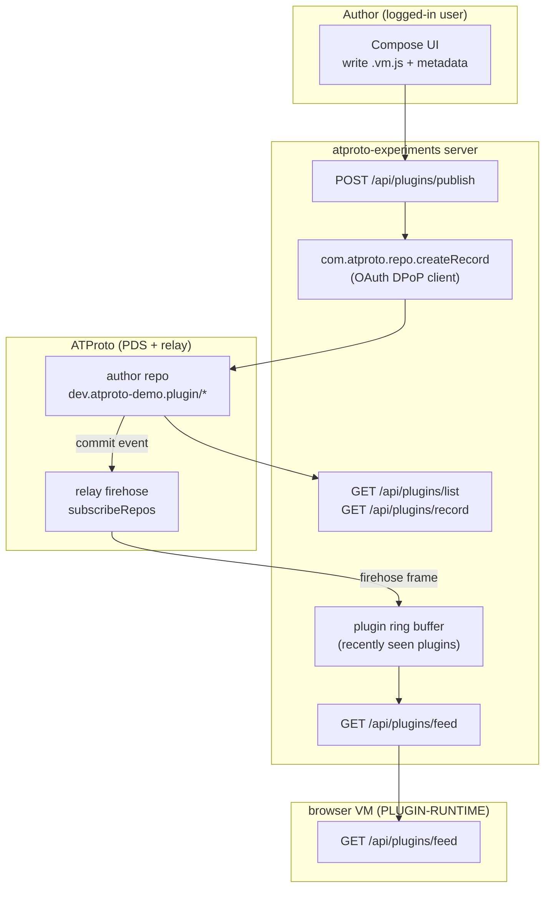

# Social JS Plugin Sharing via ATProto — Design & Implementation Guide

## 1. Executive summary

This guide designs the **publishing and feed side** of social JavaScript plugin sharing. A plugin is a small `.vm.js` source string that the companion browser VM (ticket `PLUGIN-RUNTIME`) executes inside a QuickJS sandbox. This ticket defines how a plugin script becomes an ATProto record, how it is published to the author's repository through OAuth, and how a live feed of plugins is delivered to browsers that want to discover and run them.

The deliverables are four things:

1. A **custom Lexicon** (`dev.atproto-demo.plugin`) that defines the record shape for a plugin: title, description, source code, runtime packages, capabilities, and hook metadata.
2. A **publish path** that writes a plugin record to the logged-in user's repository using the existing OAuth DPoP client (`com.atproto.repo.createRecord`), with a fine-grained scope limited to creating plugin records.
3. A **plugin feed** that decodes `dev.atproto-demo.plugin` records from the Bluesky relay firehose in real time, applying the raw-JSON decode lesson from the `REPO-BROWSER` ticket so that custom Lexicons decode without a registered Go type.
4. A **local server API and compose UI** that lets a user write a plugin in a text area, set its metadata, and publish it in one action, plus endpoints to list and fetch plugin records from any public repository.

The work builds directly on the existing `atproto-experiments` codebase. It reuses the firehose consumer, the OAuth factory (now with a persistent store), the repo browser's raw-JSON XRPC helpers, and the server's ServeMux routing. No new external Go dependencies are required.

## 2. Problem statement and scope

### 2.1 The problem

The `browser-js-inject-vm` project (ticket `BROWSER-VM-PLUGINS`) runs JavaScript plugins inside an in-browser QuickJS VM. Its documented limitation is explicit: plugins are bundled at build time through Vite `?raw` imports, and there is no network loading of third-party plugins. A user cannot publish a plugin they wrote, and a browser cannot discover plugins authored by other people.

ATProto is the natural substrate for this. An ATProto repository is a public, content-addressed, append-mostly key/value store. A plugin script is a small piece of content. If a plugin is an ATProto record, then publishing is `createRecord`, discovery is the firehose, and retrieval is `getRecord`. The social graph (who follows whom) and the identity model (DIDs, handles) come for free.

### 2.2 In scope

- Defining the `dev.atproto-demo.plugin` Lexicon and documenting its fields.
- Publishing plugin records through the OAuth-authenticated client.
- Decoding plugin records from the relay firehose into a feed.
- Server endpoints: publish, list feed, list-by-repo, get-record.
- A compose/publish UI tab in the React frontend.

### 2.3 Out of scope

- **Running** the fetched plugins in the browser VM. That is ticket `PLUGIN-RUNTIME`. This ticket delivers the bytes and metadata; that ticket executes them.
- A moderation/trust system for untrusted plugins. The runtime ticket addresses execution safety; this ticket treats plugin source as content and records content hashes.
- A custom XRPC `getPlugins` procedure. The feed uses the standard firehose plus `com.atproto.repo.listRecords`, both of which already exist.
- Blobs for very large plugins. v1 stores source inline as a string field; the blob upgrade is documented as a phase.

## 3. Background: how the existing system works

An intern should understand five existing pieces before extending them. Each is summarized here with the file that implements it.

### 3.1 The firehose consumer

`pkg/firehose/consumer.go` subscribes to `com.atproto.sync.subscribeRepos` over WebSocket on a relay. Each frame is a `#commit` event (or `#identity`, `#delete`, `#handle`). A commit carries a CAR block of new and updated records. The consumer decodes the CAR, reads each operation (`create`/`update`/`delete`), and for `app.bsky.feed.post` records it extracts the post text, author, and CID, emitting a `Post` value on a channel.

The relevant fact for this ticket: the consumer already knows how to walk commit operations and decode CBOR record blocks. The extension is to recognize a second `$type` (`dev.atproto-demo.plugin`) and decode it the same way.

### 3.2 The OAuth factory

`pkg/oauth/factory.go` provides DPoP-bound login through Bluesky. After login, `ResumeClient(r)` returns an `*atclient.APIClient` whose `AccountDID` is the logged-in user and whose `Auth` signs DPoP JWTs for every request. The scopes requested today are `atproto`, `repo:app.bsky.feed.post?action=create`, and `repo:app.bsky.feed.like?action=create`.

The relevant fact: publishing a plugin record needs a new fine-grained scope, `repo:dev.atproto-demo.plugin?action=create`, added to the scope list. The OAuth flow, token persistence, and DPoP signing are unchanged.

### 3.3 The repo browser

`pkg/repobrowser/browser.go` reads any public repository. Its `ListRecords` and `GetRecord` methods call `com.atproto.repo.listRecords` / `getRecord` through indigo's low-level `LexDo` with a `json.RawMessage` value, bypassing the typed `LexiconTypeDecoder`. This was the fix for the custom-Lexicon decode bug: indigo's typed wrappers reject any `$type` not registered in Go, so custom collections like `dev.hypercard.app.card` failed.

The relevant fact: the raw-JSON decode path already works for arbitrary collections. Listing and fetching `dev.atproto-demo.plugin` records reuses `ListRecords` and `GetRecord` with no changes.

### 3.4 The bsky client

`pkg/bsky/client.go` wraps authenticated account actions (`CreatePost`, `Like`) as free functions that take a `util.LexClient`. These use the typed `comatproto.RepoCreateRecord` with typed record values.

The relevant fact: publishing a custom-Lexicon record cannot use the typed `RepoCreateRecord_Record` with a typed value, because there is no generated Go type for `dev.atproto-demo.plugin`. The publish path must use `LexDo` with a `map[string]any` body, the same raw approach as the repo browser.

### 3.5 The server

`pkg/server/server.go` is a `net/http.ServeMux` (Go 1.22+ pattern matching). It already serves `/api/posts`, `/api/repo/*`, `/ws`, and the OAuth routes. It owns a ring buffer of recent posts and a WebSocket fan-out.

The relevant fact: the plugin feed is a second ring buffer with the same shape as the post ring buffer, and the publish/feed endpoints are new `mux.HandleFunc` registrations following the existing pattern.

## 4. Lexicon design

### 4.1 NSID choice

The Lexicon's Namespaced Identifier is `dev.atproto-demo.plugin`. NSID syntax requires a reversed-domain authority followed by a camelCase name segment. The authority `dev.atproto-demo` is two segments (`dev`, `atproto-demo`); hyphens are allowed in domain segments. The name `plugin` is ASCII letters only. The full NSID is syntactically valid per the NSID reference regex.

The authority is a namespace, not a DNS record. For a production deployment the authority should be a domain the publisher controls (for example, if the project owns `go-go-golems.dev`, the NSID would be `dev.go-go-golems.plugin`). For this experiment `dev.atproto-demo.plugin` is used consistently and is configurable in one place (`pkg/plugins/lexicon.go`).

### 4.2 Record key

The record key type is `tid` (Timestamp Identifier). A TID sorts lexicographically by creation time, so `listRecords` returns plugins newest-first when `reverse=true`. This gives the feed a natural chronological order without a separate sort field.

### 4.3 The Lexicon document

The Lexicon is a JSON document that conforms to the `lexicon` schema type system. It declares a `record` definition with an `object` schema. The full document:

```json
{
  "lexicon": 1,
  "id": "dev.atproto-demo.plugin",
  "description": "A JavaScript plugin script published for the browser QuickJS VM.",
  "defs": {
    "main": {
      "type": "record",
      "description": "A socially-shared JS plugin bundle.",
      "key": "tid",
      "record": {
        "type": "object",
        "required": ["title", "source", "packageIds", "capabilities", "createdAt"],
        "properties": {
          "title": { "type": "string", "maxGraphemes": 64, "maxLength": 128,
                     "description": "Human-readable plugin title." },
          "description": { "type": "string", "maxGraphemes": 300, "maxLength": 600,
                           "description": "What the plugin does." },
          "source": { "type": "string", "maxLength": 100000,
                      "description": "The .vm.js source. Inline for small plugins; use sourceBlob for large." },
          "sourceBlob": { "type": "blob", "accept": ["text/javascript", "application/javascript"],
                          "maxSize": 1000000,
                          "description": "Optional blob reference for large plugin source." },
          "version": { "type": "string", "maxLength": 32,
                       "description": "Semver-ish version, e.g. 1.0.0." },
          "packageIds": { "type": "array", "maxLength": 16,
                          "items": { "type": "string", "maxLength": 64 },
                          "description": "Runtime packages the sandbox must install, e.g. [\"ui\"]." },
          "capabilities": {
            "type": "object",
            "description": "Least-privilege capability grant.",
            "properties": {
              "domain": { "type": "array", "items": { "type": "string" } },
              "system": { "type": "array", "items": { "type": "string" } }
            }
          },
          "hooks": {
            "type": "object",
            "properties": {
              "feedMiddleware": { "type": "boolean" },
              "incomingFeedMessage": { "type": "boolean" }
            },
            "description": "Which feed hooks the plugin implements."
          },
          "homeSurface": { "type": "string", "maxLength": 64 },
          "license": { "type": "string", "maxLength": 64,
                       "description": "SPDX identifier, e.g. MIT." },
          "createdAt": { "type": "string", "format": "datetime" }
        }
      }
    }
  }
}
```

### 4.4 Field rationale

- **`source` (string) vs `sourceBlob` (blob).** Small plugins (a few KB) fit inline as a string and can be read in one `getRecord` call. Large plugins should use a blob: the author uploads the source as a blob to the PDS, receives a blob ref, and stores the ref in `sourceBlob`. v1 implements the inline path; the blob path is a documented phase. Both are present in the Lexicon so records are forward-compatible.
- **`packageIds` and `capabilities`.** These mirror the `PluginManifestEntry` shape in `browser-js-inject-vm/src/plugins/manifest.ts`. Storing them in the record means the runtime can install packages and enforce capabilities without a separate manifest fetch.
- **`hooks`.** Mirrors `RuntimeBundleHooksMeta` in `contracts.ts`. Lets the feed consumer and the runtime know whether a plugin participates in feed middleware.
- **`createdAt`.** Standard ATProto convention (every `app.bsky.*` record has it). ISO 8601 datetime.

### 4.5 The AT URI of a plugin

A plugin record's canonical URI is `at://<did>/<collection>/<rkey>`, for example `at://did:plc:y7opujl2vvsf4v2n5dm54tny/dev.atproto-demo.plugin/3kxwmq7nbf22j`. The `PLUGIN-RUNTIME` ticket fetches the source by this URI. Note that Go's `net/url` cannot parse `at://` URIs (colons in DIDs confuse host:port splitting); the repo browser already splits them manually.

## 5. Architecture

The system has two data paths that share the same record type.



**Publish path (write):** Compose UI → `POST /api/plugins/publish` → OAuth client `createRecord` → record stored in the author's repo. The server returns the record URI and CID.

**Feed path (read):** relay firehose → `pkg/firehose` consumer decodes `dev.atproto-demo.plugin` ops → plugin ring buffer → `GET /api/plugins/feed` → browser discovers plugins.

**Retrieval path (read on demand):** `GET /api/plugins/list?repo=<did>` and `GET /api/plugins/record?repo=<did>&rkey=<rkey>` reuse the repo browser's raw-JSON `ListRecords`/`GetRecord` to fetch full plugin source from any public repo.

## 6. Backend implementation

### 6.1 New package: `pkg/plugins`

Create `pkg/plugins/` to hold the Lexicon constant, the record Go struct (for the publish path), and the feed decoder.

**`pkg/plugins/lexicon.go`**

```go
package plugins

// NSID is the Lexicon identifier for a shared JS plugin record.
const NSID = "dev.atproto-demo.plugin"
```

**`pkg/plugins/record.go`** — a Go struct used only to construct the publish body. It is not used to decode (decoding is raw JSON; see §6.3).

```go
package plugins

import "time"

// PublishRecord is the Go shape of a dev.atproto-demo.plugin record, used to
// build the createRecord body as a map[string]any. Decoding is raw JSON.
type PublishRecord struct {
    Title        string                 `json:"title"`
    Description  string                 `json:"description,omitempty"`
    Source       string                 `json:"source"`
    Version      string                 `json:"version,omitempty"`
    PackageIDs   []string               `json:"packageIds"`
    Capabilities map[string][]string    `json:"capabilities"`
    Hooks        *Hooks                 `json:"hooks,omitempty"`
    HomeSurface  string                 `json:"homeSurface,omitempty"`
    License      string                 `json:"license,omitempty"`
    CreatedAt    string                 `json:"createdAt"`
}

type Hooks struct {
    FeedMiddleware        bool `json:"feedMiddleware,omitempty"`
    IncomingFeedMessage   bool `json:"incomingFeedMessage,omitempty"`
}

// NewPublishRecord builds a record with $type and createdAt filled in.
func NewPublishRecord(title, source string, packageIDs []string, caps map[string][]string) PublishRecord {
    return PublishRecord{
        Title:       title,
        Source:      source,
        PackageIDs:  packageIDs,
        Capabilities: caps,
        CreatedAt:   time.Now().UTC().Format(time.RFC3339),
    }
}
```

### 6.2 Publish path

`pkg/plugins/publisher.go` adds a `Publish` function that calls `createRecord` through `LexDo` with a raw map body. This bypasses the typed `RepoCreateRecord_Record` (which requires a generated Go type for the record value).

```go
package plugins

import (
    "context"
    "fmt"

    "github.com/bluesky-social/indigo/lex/util"
)

// PublishResult is the createRecord response shape we care about.
type PublishResult struct {
    URI string `json:"uri"`
    CID string `json:"cid"`
}

// Publish writes a plugin record to the authed account's repo.
// client must be the OAuth-authenticated LexClient for the logged-in user.
func Publish(ctx context.Context, client util.LexClient, rec PublishRecord) (*PublishResult, error) {
    body := map[string]any{
        "$type":        NSID,
        "title":        rec.Title,
        "description":  rec.Description,
        "source":       rec.Source,
        "version":      rec.Version,
        "packageIds":  rec.PackageIDs,
        "capabilities": rec.Capabilities,
        "homeSurface":  rec.HomeSurface,
        "license":      rec.License,
        "createdAt":    rec.CreatedAt,
    }
    if rec.Hooks != nil {
        body["hooks"] = rec.Hooks
    }
    // createRecord is a procedure (POST) with repo, collection, and record in the body.
    reqBody := map[string]any{
        "repo":       "${ACCOUNT_DID}", // see note; the SDK client knows its own DID
        "collection": NSID,
        "record":     body,
    }
    var out PublishResult
    if err := client.LexDo(ctx, util.Procedure, "", "com.atproto.repo.createRecord", reqBody, nil, &out); err != nil {
        return nil, fmt.Errorf("createRecord: %w", err)
    }
    return &out, nil
}
```

**Note on `repo`:** the `createRecord` body needs the author's DID. The OAuth `APIClient` exposes `AccountDID`. The server handler passes `api.AccountDID.String()` as the `repo` value before calling `Publish`. The pseudocode above uses a placeholder; the real code substitutes the DID in the handler.

### 6.3 Feed path: decoding plugin records from the firehose

The firehose consumer (`pkg/firehose/consumer.go`) currently decodes only `app.bsky.feed.post`. The extension adds a `dev.atproto-demo.plugin` decoder. The critical lesson from `REPO-BROWSER`: **do not use indigo's typed `LexiconTypeDecoder`**. Decode the CBOR record block as a generic `map[string]any` using `atdata.UnmarshalCBOR`.

The consumer already does this for posts. The pattern is:

```go
// inside the commit-op loop, after extracting the record block bytes:
var val map[string]any
if err := atdata.UnmarshalCBOR(recBytes, &val); err != nil { continue }
t, _ := val["$type"].(string)
switch t {
case "app.bsky.feed.post":
    // existing post decode path
case plugins.NSID: // "dev.atproto-demo.plugin"
    p := decodePlugin(authorDID, uri, cid, val)
    s.pluginCh <- p
}
```

`decodePlugin` extracts the fields the feed needs:

```go
func decodePlugin(authorDID, uri, cid string, val map[string]any) PluginSummary {
    str := func(k string) string { v, _ := val[k].(string); return v }
    return PluginSummary{
        URI:         uri,
        CID:         cid,
        AuthorDID:   authorDID,
        Title:       str("title"),
        Description: str("description"),
        Version:     str("version"),
        PackageIDs:  toStringSlice(val["packageIds"]),
        // source is intentionally NOT included in the summary; fetch on demand
    }
}
```

**Why `source` is not in the summary:** the source can be large. The feed delivers metadata (title, description, packageIds, capabilities, hooks) so the browser can show a catalog and decide which to run. The full source is fetched on demand via `GET /api/plugins/record`. This mirrors the repo browser's "list as summaries, fetch full value on demand" decision.

### 6.4 The plugin ring buffer

Add a second ring buffer to the server, mirroring the existing post ring buffer. `pkg/server/server.go`:

```go
type Server struct {
    // ...existing fields...
    pluginMu    sync.Mutex
    pluginRing  []plugins.PluginSummary
    pluginCap   int
}
```

The server subscribes to the consumer's plugin channel and pushes summaries into the ring. `GET /api/plugins/feed` returns a snapshot. Optionally, a WebSocket fan-out (like `/ws`) pushes new plugins to subscribed browsers in real time — useful for the runtime ticket's live discovery.

### 6.5 Server endpoints

New routes in `registerRoutes`:

```go
mux.HandleFunc("POST /api/plugins/publish", s.handlePublishPlugin)
mux.HandleFunc("GET /api/plugins/feed", s.handlePluginFeed)
mux.HandleFunc("GET /api/plugins/list", s.handleListPlugins)     // ?repo=&cursor=
mux.HandleFunc("GET /api/plugins/record", s.handleGetPlugin)     // ?repo=&rkey=
```

**`POST /api/plugins/publish`** (authenticated):

```go
func (s *Server) handlePublishPlugin(w http.ResponseWriter, r *http.Request) {
    api, err := s.oauth.ResumeClient(r)
    if err != nil { http.Error(w, "not authenticated", 401); return }
    var req struct {
        Title, Description, Source, Version, License string
        PackageIDs []string
        Capabilities map[string][]string
        Hooks *plugins.Hooks
    }
    if err := json.NewDecoder(r.Body).Decode(&req); err != nil { http.Error(w, err.Error(), 400); return }
    if err := validatePluginSource(req.Source); err != nil { http.Error(w, err.Error(), 400); return }
    rec := plugins.NewPublishRecord(req.Title, req.Source, req.PackageIDs, req.Capabilities)
    rec.Description, rec.Version, rec.License, rec.Hooks = req.Description, req.Version, req.License, req.Hooks
    out, err := plugins.Publish(r.Context(), api, rec)
    if err != nil { http.Error(w, err.Error(), 502); return }
    json.NewEncoder(w).Encode(out) // {uri, cid}
}
```

**`GET /api/plugins/feed`** (public): returns `s.pluginRing` snapshot, newest first.

**`GET /api/plugins/list?repo=<did>&cursor=`** (public): delegates to `s.repos.ListRecords(ctx, repo, plugins.NSID, cursor, 50, nil)`. Returns summaries. Reuses the raw-JSON repo browser path.

**`GET /api/plugins/record?repo=<did>&rkey=<rkey>`** (public): delegates to `s.repos.GetRecord(ctx, repo, plugins.NSID, rkey, nil)`. Returns the full record JSON including `source`.

### 6.6 OAuth scope

Add the plugin create scope to `pkg/oauth/factory.go`:

```go
var defaultScopes = []string{
    "atproto",
    "repo:app.bsky.feed.post?action=create",
    "repo:app.bsky.feed.like?action=create",
    "repo:dev.atproto-demo.plugin?action=create", // NEW
}
```

Because the OAuth client metadata is generated from this scope list, the user consents to plugin creation during login. The DPoP-bound token is then authorized for `createRecord` on `dev.atproto-demo.plugin`.

## 7. Frontend: the compose/publish UI

Add a third tab, **Publish**, to `frontend/src/App.tsx`, alongside Firehose and Repository. The component lives in `frontend/src/PublishPlugin.tsx`.

```tsx
function PublishPlugin() {
  const [title, setTitle] = useState('');
  const [description, setDescription] = useState('');
  const [source, setSource] = useState('// defineRuntimeBundle(({ ui }) => ({ ... }))\n');
  const [packageIds, setPackageIds] = useState('ui');
  const [result, setResult] = useState<{uri: string; cid: string} | null>(null);
  const [error, setError] = useState('');

  async function publish() {
    const res = await fetch('/api/plugins/publish', {
      method: 'POST',
      headers: { 'Content-Type': 'application/json' },
      body: JSON.stringify({
        title, description, source,
        packageIds: packageIds.split(',').map(s => s.trim()),
        capabilities: { domain: ['feed'], system: [] },
      }),
    });
    if (!res.ok) { setError(await res.text()); return; }
    setResult(await res.json());
  }

  return (
    <div className="publish">
      <input value={title} onChange={e => setTitle(e.target.value)} placeholder="Plugin title" />
      <textarea value={source} onChange={e => setSource(e.target.value)} rows={20} />
      <button onClick={publish}>Publish</button>
      {result && <div>Published: {result.uri}</div>}
    </div>
  );
}
```

The source editor is a plain `<textarea>` for v1. A syntax-highlighting editor (reusing the dependency-free tokenizer from `browser-js-inject-vm/src/components/SourceViewer.tsx`) is a future enhancement.

## 8. Decision records

### DR-1: Store source inline as a string, not as a blob

**Context.** Plugin source can be 1–100 KB. ATProto supports blobs for large content.

**Options.** (a) Inline `source` string. (b) `sourceBlob` blob reference. (c) Both.

**Decision.** (c) Both fields in the Lexicon; v1 implements the inline string path only.

**Rationale.** Inline strings make `getRecord` return the source in one call, which simplifies the runtime ticket. Blobs add a two-step upload (upload blob, then reference) and require PDS blob handling. For a demo with small plugins, the inline path is sufficient and simpler to teach. The blob field is present so records can upgrade without a Lexicon migration.

**Consequences.** Records over ~100 KB will bloat `listRecords` responses if `source` is included in list output. Mitigation: the feed path decodes only summaries, not source (§6.3). `listRecords` returns the full record value; if source size matters, switch to blobs.

### DR-2: Decode firehose records as raw `map[string]any`, not typed structs

**Context.** indigo's `LexiconTypeDecoder` rejects unregistered `$type` values with `ErrUnrecognizedType`. `dev.atproto-demo.plugin` is a custom Lexicon with no generated Go type.

**Decision.** Decode record blocks with `atdata.UnmarshalCBOR` into `map[string]any` and switch on the `$type` string.

**Rationale.** This is the verified fix from `REPO-BROWSER`. It works for any collection. A typed struct would require code generation or manual registration and would couple the consumer to the Lexicon version.

**Consequences.** No compile-time type safety on decoded fields. Acceptable for a feed consumer that only reads a few known fields.

### DR-3: Publish through `LexDo` with a map body, not typed `RepoCreateRecord`

**Context.** `comatproto.RepoCreateRecord`'s typed `Record` field requires a registered type. Custom records have none.

**Decision.** Call `client.LexDo(ctx, util.Procedure, "", "com.atproto.repo.createRecord", bodyMap, nil, &out)`.

**Rationale.** Same raw approach as the repo browser's list/get. The body is a `map[string]any` with `$type`, `repo`, `collection`, and `record`. The PDS validates the record against the Lexicon if it has the schema; otherwise it stores it as-is.

**Consequences.** The PDS may reject the record if it does not know the `dev.atproto-demo.plugin` Lexicon. For bsky.social PDSs, custom records are accepted without server-side schema validation (the PDS stores records generically). Document this as a caveat.

### DR-4: Feed summaries exclude source; fetch on demand

**Context.** The firehose delivers every new plugin. Including full source in the feed would push large payloads to every browser.

**Decision.** The ring buffer and `GET /api/plugins/feed` return summaries (uri, cid, title, description, packageIds). The browser fetches full source via `GET /api/plugins/record` only when the user chooses to run or inspect a plugin.

**Rationale.** Mirrors the repo browser's list/get split. Keeps the feed lightweight.

## 9. Phased implementation plan

**Phase 1 — Lexicon + publish (backend).**
- `pkg/plugins/lexicon.go`, `record.go`, `publisher.go`.
- Add scope to `pkg/oauth/factory.go`.
- `POST /api/plugins/publish` in `pkg/server/server.go`.
- Verify: log in, publish a plugin, confirm the record appears via `curl /api/plugins/list?repo=<did>`.

**Phase 2 — Feed (firehose decode + ring buffer).**
- Extend `pkg/firehose/consumer.go` with the `dev.atproto-demo.plugin` case.
- Add plugin ring buffer + `GET /api/plugins/feed`.
- Verify: publish a plugin, see it appear in the feed endpoint within seconds.

**Phase 3 — Retrieval endpoints.**
- `GET /api/plugins/list` and `GET /api/plugins/record` (thin wrappers over `pkg/repobrowser`).
- Verify: list returns published plugins; record returns full source.

**Phase 4 — Compose UI.**
- `frontend/src/PublishPlugin.tsx` + tab in `App.tsx`.
- Verify: write a plugin in the textarea, publish, see the URI.

**Phase 5 (future) — Blobs.** Implement `sourceBlob` upload via `com.atproto.repo.uploadBlob`, reference the blob ref in the record, and have the runtime fetch blobs by ref.

## 10. Testing strategy

- **Unit:** `decodePlugin` with a synthetic CBOR map (use `atdata` to marshal a test map). Assert field extraction and the `$type` switch.
- **Unit:** `Publish` body construction — assert the `map[string]any` has the correct `$type` and `collection`.
- **Integration:** start the server against the live relay, publish a plugin from the test account, assert it appears in `GET /api/plugins/feed` within a timeout.
- **Manual (Playwright):** open the Publish tab, write a plugin, publish, switch to the Repository tab, confirm the record is listed under `dev.atproto-demo.plugin`.

## 11. Risks and open questions

- **PDS schema validation.** A PDS may or may not validate custom records against a Lexicon. bsky.social accepts generically-typed records. If a future PDS rejects unknown `$type`s, publishing fails. Mitigation: the error surfaces in the publish response.
- **Firehose completeness.** The relay firehose may drop frames under load; the feed is best-effort, not a complete index. A backfill via `listRecords` (the retrieval endpoint) covers gaps.
- **Source size limits.** Inline source up to ~100 KB is safe; beyond that, blobs.
- **Scope granularity.** `repo:dev.atproto-demo.plugin?action=create` limits the token to creating plugin records. It does not grant delete/update; add `?action=delete` if plugin removal is needed.
- **Content moderation.** Untrusted plugin source is arbitrary JavaScript. This ticket treats it as content; the runtime ticket is responsible for safe execution. A future trust signal (labels, follows) could rank the feed.

## 12. Key file references

| File | Role |
| --- | --- |
| `pkg/plugins/lexicon.go` (new) | NSID constant |
| `pkg/plugins/record.go` (new) | Publish record Go struct |
| `pkg/plugins/publisher.go` (new) | `Publish` via raw `LexDo` |
| `pkg/firehose/consumer.go` | Add `dev.atproto-demo.plugin` decode case |
| `pkg/oauth/factory.go` | Add plugin create scope |
| `pkg/repobrowser/browser.go` | Reused for `list`/`record` endpoints |
| `pkg/server/server.go` | New routes + plugin ring buffer |
| `frontend/src/PublishPlugin.tsx` (new) | Compose/publish UI |
| `frontend/src/App.tsx` | Add Publish tab |
| `sources/specs/lexicon.md` | Lexicon schema reference |
| `sources/specs/nsid.md` | NSID syntax reference |

## 13. Glossary

- **NSID** — Namespaced Identifier; the `authority.name` key for a Lexicon (e.g. `dev.atproto-demo.plugin`).
- **Lexicon** — A JSON schema document describing a record, query, or procedure type.
- **TID** — Timestamp Identifier; a sortable record key.
- **DPoP** — Demonstrating Proof-of-Possession; the token-binding method used by the OAuth client.
- **Ring buffer** — A fixed-size circular buffer of recent items, used for the feed snapshot.
